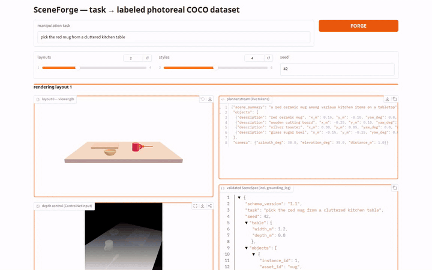
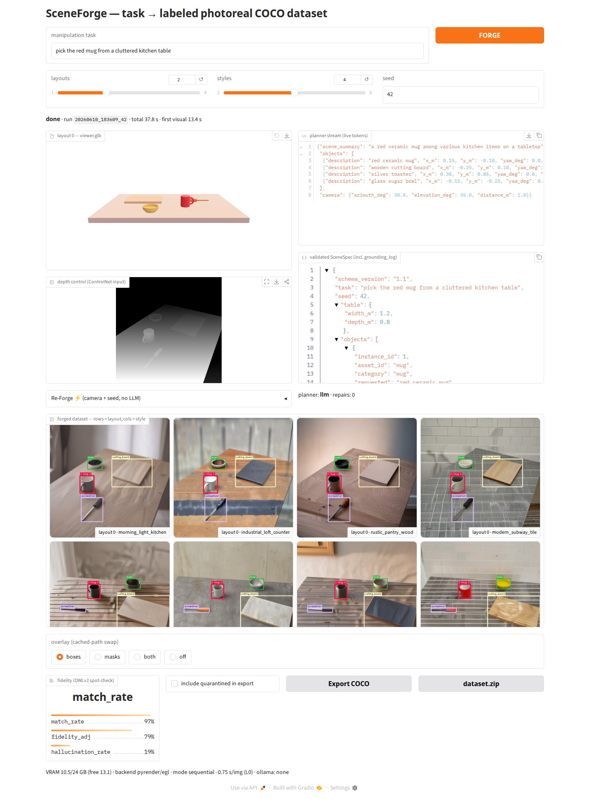
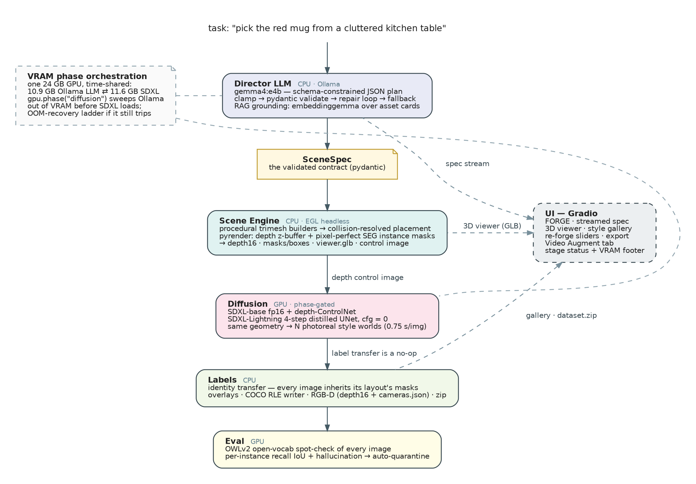

# SceneForge

**Type a robot-manipulation task in English, get a labeled, photoreal, domain-randomized COCO dataset.**

SceneForge turns one sentence — *"pick the red mug from a cluttered kitchen table"* — into a downloadable COCO dataset with pixel-perfect instance masks. A local LLM plans the 3D scene as validated JSON; a deterministic headless renderer owns the geometry, producing depth maps and exact instance masks; depth-ControlNet SDXL-Lightning then re-textures that *same geometry* into N photoreal style worlds. Because geometry is preserved across variants, the renderer's masks and boxes transfer to every generated image for free — and OWLv2 spot-checks that claim on every image (recall *and* hallucination), auto-quarantining drifters. Everything runs locally on a single 24 GB GPU.



*15-second highlight of one live, unmocked session: the style gallery fills in real time (shown 2×), the mask overlay swaps instantly from the cached path, and a camera re-forge re-labels the moved scene in 1.8 s with no LLM call.*



Full 74 s demo video and capture notes: see [`docs/demo/`](docs/demo/).

---

## Architecture



<details>
<summary>ASCII version (for terminal readers)</summary>

```text
 task: "pick the red mug from a cluttered kitchen table"
        │
        ▼
┌─ DIRECTOR (CPU + Ollama) ───────────────────────────────────────────┐
│ gemma4:e4b chat(format=json_schema, streamed to UI) → raw plan      │
│   → clamp_to_bounds → pydantic LLMScenePlan (repair loop ≤2,        │
│     deterministic template fallback)                                │
│   → RAG grounding: embeddinggemma cosine search over asset cards    │
│   → style synthesis (2nd LLM call, CLIP-77 token budget enforced)   │
└──────────────┬──────────────────────────────────────────────────────┘
               ▼  SceneSpec (the contract)
┌─ SCENE ENGINE (CPU + EGL) ──────────────────────────────────────────┐
│ procedural trimesh builders → snap/collision placement →            │
│ pyrender EGL: depth z-buffer + SEG instance pass →                  │
│ depth16.png · seg ids · {mask RLE, bbox} · viewer.glb · control.png │
└──────────────┬──────────────────────────────────────────────────────┘
               ▼  RenderResult
┌─ DIFFUSION (GPU, phase-gated) ──────────────────────────────────────┐
│ gpu.phase("diffusion"): Ollama models swept out of VRAM first       │
│ SDXL-base fp16 + depth-ControlNet + Lightning 4-step UNet, cfg=0    │
│ layouts × styles → images (0.75 s each @ 768²)                      │
└──────────────┬──────────────────────────────────────────────────────┘
               ▼  every image inherits its layout's labels (no-op transfer)
┌─ LABELS & EVAL ─────────────┐   ┌─ UI (Gradio) ──────────────────────┐
│ overlays · COCO writer+zip  │   │ FORGE · streamed spec · 3D viewer  │
│ OWLv2 recall+hallucination  │   │ style gallery · re-forge sliders   │
│ → fidelity_adj → quarantine │   │ export · stage status + VRAM       │
└─────────────────────────────┘   └────────────────────────────────────┘
```

</details>

### The six stages

| stage | what it does | models |
|---|---|---|
| 1. Director | task → scene plan as schema-constrained JSON, streamed to the UI; clamp → validate → repair loop → deterministic fallback | `gemma4:e4b` via Ollama (`format=json_schema`) |
| 2. Grounding + placement | RAG match of free-text object descriptions to the 15-asset library; deterministic collision-resolved tabletop placement | `embeddinggemma` via Ollama (committed embedding cache; difflib fallback) |
| 3. Render | headless EGL render of each layout: depth, pixel-perfect SEG instance masks, GLB for the 3D viewer, MiDaS-style disparity control image | pyrender 0.1.45 (EGL), trimesh |
| 4. Diffusion | depth-conditioned re-texturing of the same geometry into N style worlds, 4 steps per image | SDXL-base 1.0 + `diffusers/controlnet-depth-sdxl-1.0` + `ByteDance/SDXL-Lightning` 4-step UNet + `madebyollin/sdxl-vae-fp16-fix` |
| 5. Labels | identity label transfer; overlay renderer; COCO RLE writer with global annotation ids; dataset.zip export | — (pycocotools) |
| 6. Eval | open-vocabulary spot-check of every image: per-instance recall IoU vs renderer GT plus hallucination counting; auto-quarantine | `google/owlv2-base-patch16-ensemble` |

### Course techniques demonstrated

- **Prompt engineering** — world-model planner prompt with few-shot example; category-first style prompts (CLIP truncates at 77 tokens, so object categories are forced into the first clause).
- **Structured output / constrained decoding** — Ollama grammar-constrains the planner to the pydantic JSON schema; verified gap (numeric bounds are *not* enforced) is closed deterministically by `clamp_to_bounds` before validation.
- **RAG** — embeddinggemma document/query embeddings over asset cards, numpy cosine retrieval, committed index cache.
- **ControlNet conditioning** — depth-ControlNet pins the generated image to the rendered geometry; that is the entire label-transfer thesis, validated quantitatively (M1 gate below).
- **Inference acceleration via distillation** — SDXL-Lightning 4-step distilled UNet at `guidance_scale=0`: 4 steps × 1 UNet eval vs 20 steps × 2 (CFG) ≈ **25× fewer UNet evaluations** than stock SDXL, measured 0.75 s/img.
- **Custom diffusers pipeline** — hand-assembled `StableDiffusionXLControlNetPipeline` with swapped distilled UNet, fp16-fix VAE, trailing-timestep Euler scheduler, and a tested OOM-recovery ladder.
- **VRAM phase orchestration** — a 10.9 GB LLM and an 11.6 GB diffusion pipeline time-share one 24 GB GPU via explicit phase barriers (`gpu.phase("diffusion")` sweeps Ollama out of VRAM before SDXL loads).

---

## Verified results

> **M1 go/no-go gate (label-transfer validity, 45 GT instances):**
> match_rate **0.911** (gate ≥ 0.70) · mean matched IoU **0.923** (gate ≥ 0.65) · hallucination_rate 0.067 (reported) — **GO at L0**, reproduced exactly across two runs.
>
> **Performance (RTX 3090, 768², fp16):**
> raw generation **0.75 s/img** · end-to-end warm forge (2 layouts × 4 styles) **35.8 s** · re-forge (camera/seed nudge, no LLM) **1.7 s**.
>
> **Tests:** 229 green (`./scripts/run_tests.sh`).

Full numbers and methodology: [`docs/m1_report.md`](docs/m1_report.md).

---

## Quickstart

Requirements: Linux with an NVIDIA GPU (~12 GB VRAM in use; developed on a 24 GB RTX 3090), [Ollama](https://ollama.com) running locally, ~20 GB free disk. Rendering is headless via **EGL** (no display needed); `PYOPENGL_PLATFORM=egl` is set automatically on import.

```bash
# 1. Environment
conda create -n dgan python=3.11
conda activate dgan
pip install -r requirements.txt

# 2. Local LLMs (Ollama)
ollama pull gemma4:e4b
ollama pull embeddinggemma

# 3. Launch — HF diffusion/eval weights auto-download on first run (~15 GB).
#    On flaky networks, HF_HUB_DISABLE_XET=1 avoids stalled Xet/CAS downloads.
python app.py            # Gradio on http://127.0.0.1:7860
```

First launch pre-warms the models in a background thread (~40 s; the UI is up immediately and shows a warming banner). Type a task, hit **FORGE**, watch the spec stream, the 3D viewer populate, and the style grid fill in; **Export** downloads the COCO `dataset.zip`.

Before a live demo:

```bash
scripts/demo_prep.sh     # pre-warms gemma + SDXL + one throwaway forge
```

Run the test suite:

```bash
./scripts/run_tests.sh   # 229 tests
```

Notes:

- Every LLM-touching path has a deterministic fallback — a forge completes end-to-end even with the Ollama server stopped (`source: fallback` shown in the UI).
- Runtime knobs live in [`sceneforge.yaml`](sceneforge.yaml) (overridable via `SCENEFORGE_<SECTION>_<FIELD>` env vars).
- Run artifacts land in `outputs/runs/<run_id>/` (specs, depth/seg/control images, GLBs, per-image fidelity, COCO export).

---

## Repository layout

```text
app.py                  # entry point: python app.py → Gradio on :7860
sceneforge.yaml         # runtime config (gen level, VRAM mode — frozen by M1)
requirements.txt        # exact pins
sceneforge/
  spec.py               # THE data contract (pydantic) + clamp_to_bounds
  orchestrator.py       # ForgeRun: demo-paced pipeline, progress events
  gpu.py                # VRAM phase barriers, Ollama unload, OOM ladder
  director/             # Ollama client, planner/styler, RAG, fallbacks
  assets/               # 15 procedural asset builders + library
  scene/                # placement (collision resolve) + composition
  render/               # pyrender EGL backend: depth + SEG instance masks
  diffusion/            # depth→disparity control prep + custom SDXL pipeline
  labels/               # masks/RLE, overlays, COCO writer + zip export
  eval/                 # OWLv2 fidelity scorer (recall + hallucination)
  augment/              # v2: real-frame restyler + native LeRobot v2.x reader/writer (lerobot_io.py)
  ui/                   # Gradio blocks + handlers (Forge tab + Video Augment tab)
assets/cards|index/     # asset cards + committed embedding cache
scripts/                # run_tests.sh · demo_prep.sh · m1_smoketest.py ·
                        # augment_frames.py · augment_dataset.py · forge_viewsweep.py · ...
tests/                  # 229 tests
docs/                   # see below
```

Deeper reading:

- [`docs/ARCHITECTURE.md`](docs/ARCHITECTURE.md) — full design doc: schemas, coordinate conventions, data contracts, VRAM policy, every settled decision.
- [`docs/WORKFLOW_LOG.md`](docs/WORKFLOW_LOG.md) — **agent collaboration log (course deliverable)**: how the project was ideated, reviewed, built, and verified by a multi-agent workflow.
- [`docs/m1_report.md`](docs/m1_report.md) — quantitative go/no-go report behind the results box above.

---

## Limitations (measured, not hedged)

- **First visual is ~13 s warm, not the ≤5 s we aimed for.** The planner LLM call dominates time-to-first-layout. Tokens stream into the UI from ~1 s, so the interface is never silent, but the aspiration was missed.
- **LLM plans are deterministic only within a server session.** Ollama's prefix cache introduces nondeterminism across fresh server processes even with fixed seeds. Geometry, placement, diffusion seeds, and the fallback planner are byte-deterministic.
- **OWLv2 fidelity is a lower bound.** The detector's own box jitter caps measurable IoU; a "miss" can be a detector failure rather than a label failure (which is why gate stats exclude instances under 1000 px²).
- **0.75 s/img is generation-only.** Wall-clock is ~1.6 s/img including overlay rendering and I/O.
- **M1 metrics are a clean-scene upper bound.** They were measured on synthetic, generously spaced scenes from the procedural asset set; dense 8-object director scenes with occlusion will score lower.

---

## v2 — Robot-learning data tools (video-first)

VLA/robot-policy training data is mostly *video episodes*, not single images — so v2 extends SceneForge from a text-to-dataset forge into a data-augmentation toolkit for real robot recordings:

| Tool | What it does | Usage |
|---|---|---|
| `scripts/augment_frames.py` (`sceneforge.augment`) | ROSIE-style appearance randomization of **real** robot frames or videos: near-workspace pixels are bitwise-preserved (action labels stay exactly valid), the background is re-imagined per style under depth control with temporally smoothed masks; video in → video out | `python scripts/augment_frames.py EPISODE_OR_VIDEO --out OUT --n-styles 4 [--llm-styles]` |
| `scripts/augment_dataset.py` | **LeRobot v2.x dataset in → LeRobot datasets out**: restyles chosen camera streams of a whole episode dataset; parquet/actions/states/timestamps copied bytewise, one valid output dataset per style, provenance fingerprint included | `python scripts/augment_dataset.py --dataset DIR --out DIR --cameras KEY --n-styles 2` |
| `scripts/forge_viewsweep.py` | same scene exported across a camera grid — viewpoint-randomized data, one COCO zip with per-image intrinsics `K` + extrinsics pose | `python scripts/forge_viewsweep.py --task "..." --views 8 --styles 2` |
| RGB-D COCO export (default) | every export carries rendered metric depth (`depth/*_depth16.png`) + `cameras.json` | automatic in UI export and both scripts |

The Gradio app gains a **Video Augment tab**: upload an episode video (or frames dir), pick styles, and get side-by-side original/restyled players, a mask audit sheet, and a zip download — same VRAM phase discipline as the Forge tab.

Validated on this machine: 12-frame episode restyle in 23.6 s (0.55 s/img; near pixels verified bitwise-identical at the composite stage, within codec noise after h264 re-encode); a real mini LeRobot v2.1 dataset augmented end-to-end in 47 s with both outputs passing structural validation; 4-view × 2-style sweep exports a COCO zip whose camera matrices match the renderer's normative projection to 1e-5. Test suite: 229 green.

---

## Acknowledgment

Built end-to-end through an agentic workflow (Claude Code, Fable 5) with multi-agent ideation, adversarial design review, implementation, and verification; the full process is documented in [`docs/WORKFLOW_LOG.md`](docs/WORKFLOW_LOG.md).
